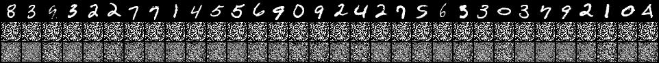
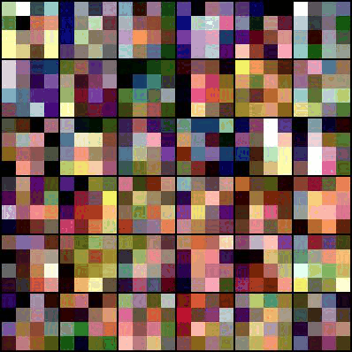

# Pytorch ALAE
A simple Pytorch implementation of the paper "Adverserial Latent AutoEncoder".
The paper: https://arxiv.org/abs/2004.04467 \
Official implementation https://github.com/podgorskiy/ALAE

## Experiments
#### 1: train MLP-ALAE on mnist
The first experiment on the paper was training an MLP version of ALAE on Mnist
The training result of 100 epochs:
(First row: Real images; second row: reconstructed images; third row randomly generated digits)


reprodue:
```
python3 train_MlpALAE.py
```
#### 2: train Style-GAN on face images.
This experiment serves as a baseline to styleAlae
Style gan on LFW (64x64 resize) with no tricks (truncation, style-mixing):



reprodue:
```
python3 train_StyleGan.py --dataset_name LFW
```
#### 3: train Style-ALE on face images
Results of Style ALAE on FFHQ (64x64 resize):
(First row: Real images; second row: reconstructed images; third row randomly generated digits)


reprodue:
```
python3 train_StyleALAE.py --dataset_name FFHQ
```
## requirements
- imageiofile
- kaggle
- numpy
- opencv-python
- torch
- torchvision
- tqdm


### Relevant papers:
- PGGANs: https://arxiv.org/pdf/1710.10196.pdf
- StyleGAN: https://arxiv.org/abs/1812.04948

### Credits:
I Consulted and used parts of the codes in
* https://github.com/podgorskiy/ALAE
* https://github.com/rosinality/style-based-gan-pytorch.git
* https://github.com/SiskonEmilia/StyleGAN-PyTorch.git